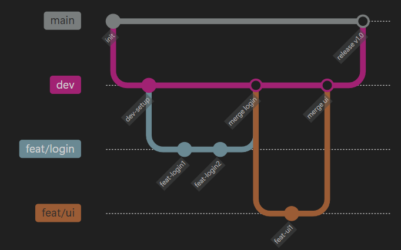

## Overwiew
ssafy를 시작하고 2주 동안 스타트캠프(워밍업)를 진행했었는데, 이때 조원들과 지하철 에스컬레이터 안내 서비스를 기획까지만 진행해보는 시간이 있었다. 2달이 훌쩍지난 지금 아직 많이 부족하지만 웹도 배우고, 장고도 배우고, 알고리즘도 배우고 하다보니 그때 기획했던 지하철 에스컬레이터 안내 서비스 프로젝트를 실제로 진행해보고 싶었다. 

## Start 'wisheasy'
### 주제 선정 배경
‘에스컬레이터 안내 서비스’라는 주제를 정한 이유는  
매일 아침 **출근 지옥철**을 직접 경험하면서였다.
한 시간 동안 꽉 낀 지하철을 타고 오르내릴 때마다,  
“내릴 때만큼은 좀 더 편하게 이동하고 싶다”는 생각이 들었기 때문이다.

### 문제 인식
실제 역 내부 구조를 보면,
이동 경로에 따라 **에스컬레이터가 설치된 구간**도 있고  
**계단만 있는 구간**도 존재한다.  
그러나 현재의 지하철 안내 서비스는
- 역 간 이동, 환승 안내,  
- 또는 ‘계단 회피 경로’ 정도까지만 지원할 뿐  
**역 내 이동 동선(에스컬레이터 중심 안내)**은 제공하지 않는다.

### 프로젝트 목표
그래서 **“승객이 역 내부에서도 에스컬레이터를 중심으로 이동할 수 있게 하자”**
라는 아이디어로 프로젝트를 시작하게 되었다.  
이를 통해 이용자는
- 불필요한 계단 이동을 줄이고,  
- 이동 피로도를 낮추며,  
- 보다 **쉽고 편한 지하철 이용 경험**을 얻을 수 있을 것이다.

### 개인적인 목표
또한 'wisheasy' 프로젝트는 내적으로도 두 가지 목표를 가지고 있다.
\
\
첫 번째는 **"풀스택 기술 경험"**이다. 
- `서비스 기획안` 
- `기능 정의서`
- `데이터 수집 및 전처리`
- `ERD 작성`
- `DB 구축`
- `프론트앤드` 와 `백앤드`
- `CI / CD 자동화` 
등 프로젝트에 과정 속에서 사용되는 전체적인 과정과 기술을 경험해보면서 구조를 학습해보고자 한다. 

두 번째는 **"체계적인 협업 경험"**이다.
\
아직 부족한 점이 많기 때문에 앞서 얘기한 모든 과정을 모든 팀원이 모두 이해하고 진행하기에는 많은 어려움이 있을 것이다. 
\
그래서 우리팀(5명)은 협업 규칙과 제도를 도입해서 체계적인 협업을 통해 이를 해결해보고자 한다.
- `전문가 제도` 
- `노션 활용(스크럼 회의, 문서화)`
- `깃허브(브랜치 전략, 커밋 컨벤션)`
이를 위해 도입한 것들이다.

### 전문가 제도
먼저 전문가 제도가 무엇이냐? 역할 분담의 업그레이드 버전인데 각자 역할을 맡은 분야의 전문가가 되어 다른 팀원들을 이끌도록 한 것이다. 전문가는 다음과 같은 역할을 갖는다

1. 맡은 분야의 부족한 부분을 공부하여 자료 정리 후 팀원들에게 강의하여 이해시킨다.
2. 프로젝트 진행 시 전체적인 목표설정과 진행에 책임을 진다.
3. 필요시 팀원들에게 역할을 부여해준다. 

우리팀은 `PM` / `데이터 분석` / `DB` / `FE` / `BE` 으로 나누었고, 나는 데이터 분석을 맡았다.
사실 데이터 분석이라기 보단 기능에 필요한 데이터 셋을 구축하고 기능을 구현하는 역할을 맡았다.

### 노션 활용
노션 활용에 있어서 크게 스크럼 회의와 문서화를 잘 활용하고자 한다.

**스크럼 회의**
먼저 스크럼 회의는 매일 각자 전날 진행한 내용 및 에러 사항, 오늘 진행할 내용을 정리해놓고, 15분 정도 간단히 회의를 하는 것이다. 
진행 상황을 투명하게 하여 문제를 조기 발견하고 우선순위 조정을 용이하게 해서 팀 전체가 함께 진행해나가고자 하는 목적을 갖는다.

**문서화**
앞서 말했듯이 프로젝트의 전체적인 기술을 팀 모두가 이해하고 진행하기 어렵다는 점을 보완하기 위해 문서화를 상세하게 작성하고자 한다. 각자 진행 내용, 관련된 기술 내용 등을 문서화하고 공유하면서 추후 팀원들이 관련 내용을 쉽게 이해할 수 있도록 하고자 했다.    

### 깃허브 활용
팀원들과 하나의 레포지토리에서 효과적으로 관리하고 개발하기 위해서 브랜치 전략과 우리팀만의 커밋컨벤션 규칙을 만들어 적용하기로 했다.

**브랜치 전략**
우리 팀의 브랜치 전략은 다음과 같다
- **`master`**: 배포용, 병합 시 자동 배포(CI/CD).
- **`develop`**: 코드 통합용 브랜치, 기능 병합 후 자동화 테스트(CI) 실행.
- **`feature`**: 기능 단위 작업 브랜치, 완료 후 PR로 `develop`에 병합
  

**커밋컨벤션**
커밋 컨벤션이란 팀원들이 Git 커밋 메시지를 일관된 형식으로 작성하기 위한 약속인데, Git 히스토리를 깔끔하게 관리하고, 자동화된 문서 생성 및 버전 관리를 용이하게 할 수 있게 해준다. 때문에 모두가 공통적인 형식으로 작성하는 것이 중요한데 이를 위해 팀원들과의 커밋컨벤션 규칙을 문서화했다. 

Conventional Commits를 기반으로 하면서 특히 
- `왜(Why)`: 이 커밋이 필요한 이유
- `무엇(What)`: 무엇이 바뀌었는지 요약
- `어떻게(How)`: 어떻게 해결했는지 핵심 방식
를 명확히 하여 정리하고자 했다.

### 앞으로,,
우선 데이터, 기능 구현 역할을 맡았으니 기능 정의서를 기반으로 필요한 데이터를 찾아보고 어떻게 기능 구현을 할지 고민해봐야겠다. 